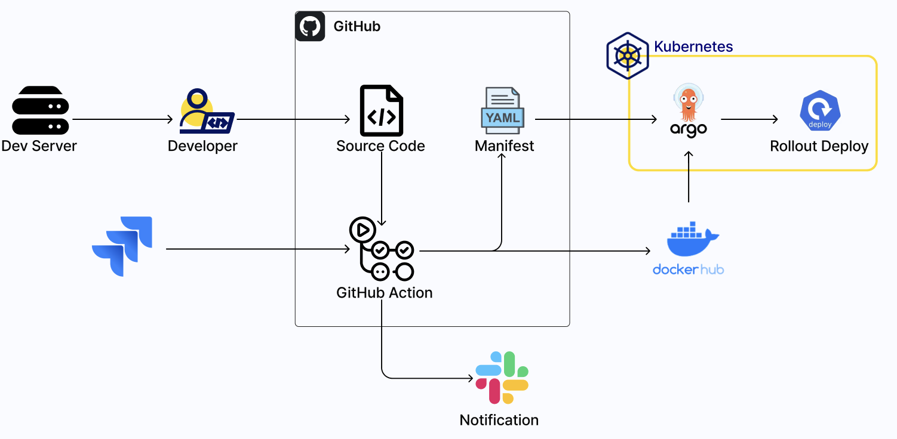

### GitHub Actions이란?

**GitHub Actions**는 **소프트웨어 개발 워크플로우를 자동화하는 데 사용되는 도구**입니다. 개발자가 코드 저장소 내에서 직접 코드를 빌드, 테스트, 배포할 수 있게 해주는 CI/CD 플랫폼이라고 할 수 있습니다.

이 도구를 사용하는 가장 큰 이유는 \*\*'자동화'\*\*와 \*\*'편리함'\*\*에 있습니다. 반복적이고 수동적인 작업을 자동화하여 개발 프로세스의 효율성을 극대화하는 거죠. 예를 들어, 코드를 푸시할 때마다 자동으로 테스트를 실행하거나, 새로운 버전이 릴리스될 때마다 애플리케이션을 배포하는 것 등이 가능합니다. 그리고 다른 자동화 툴들과 다르게 그저 워크플로우를 생성하고 쉘 스크립트를 작성하기만 하면 뚝딱~하고 완성됩니다! 와우!

-----

### GitHub Actions의 주요 구성 요소

GitHub Actions를 이해하려면 몇 가지 핵심 개념을 알아야 합니다.

  * **Events (이벤트)** : **'무슨 일이 일어났을 때?'**를 정의합니다. 예를 들어, PR이 main 브랜치로 머지되거나, 커밋을 푸시하거나, 이슈가 생성되는 등의 특정 행동을 말합니다.

  * **Workflows (워크플로우)** : **이벤트가 발생할 때 어떤 일을 할 것인지(목록)**를 정의합니다. YAML 파일에 작성되며, on: [push]와 같이 이벤트가 명시됩니다.

  * **Jobs (작업)** : 워크플로우 안에 있는 개별적인 행동 단위입니다. '밥 먹기, 수영하기, 놀러가기'처럼 하나의 워크플로우 안에 다수의 Job이 존재할 수 있습니다. 보통 동시병렬적으로 실행되지만, 순차적으로 진행하도록 커스텀할 수도 있습니다.

  * **Steps (단계)** : 작업을 구성하는 순서 명시입니다. 개별적인 명령어 수행 단위를 의미합니다.

  * **Actions (액션)** : 재사용할 수 있도록 만들어진 공개적인 명령어입니다. step에서 uses: 키워드를 사용해 호출하며, 복잡한 기능을 한 줄로 쉽게 사용할 수 있게 해줍니다.

  * **Runners (러너)** : 각각의 Job들을 실행하는 가상 환경입니다. VM(가상 머신)이나 Docker 컨테이너 위에서 스크립트가 실행됩니다.

-----

### 왜 GitHub Actions를 사용하는가?

GitHub Actions는 **왜(Why) 코드를 자동화해야 하는가**와 **무엇을(What) 자동화할 수 있는가**에 대한 명확한 해답을 제공합니다.

  * **왜(Why)?** : 개발자가 수동으로 해야 하는 반복적인 작업을 줄여줍니다. 이를 통해 개발자는 더 중요한 문제 해결에 집중할 수 있고, 사람의 실수로 인한 오류를 줄여 코드의 신뢰성을 높일 수 있습니다.
  * **무엇을(What)?** : 코드 빌드, 테스트, 배포뿐만 아니라, **웹훅(Webhook)을 통한 다양한 외부 서비스와의 연동**이 가능합니다. 이 기능은 개발 프로세스의 투명성과 협업 효율을 크게 향상시킵니다. 예를 들어, 다음과 같은 작업을 자동화할 수 있습니다.
      * **Slack/Discord 알림 :** 코드 병합(merge) 또는 배포 성공/실패 시 팀 채널에 알림 메시지를 보냅니다.
      * **Jira 이슈 연동 :** 특정 커밋 메시지를 통해 Jira 티켓의 상태를 자동으로 변경하거나, 새로운 풀 리퀘스트(PR)가 열릴 때 관련 Jira 이슈에 댓글을 남깁니다.
      * **Notion 페이지 업데이트 :** 배포가 완료되면 Notion에 있는 프로젝트 상태 페이지를 자동으로 업데이트합니다.

이러한 **다양한 툴과의 연동성**은 GitHub Actions의 핵심적인 장점 중 하나로, 개발 팀의 워크플로우를 유연하고 강력하게 만들어 줍니다.

-----

### GitHub Actions 사용 방법

GitHub Actions는 별도의 설치 과정이 필요 없는 **클라우드 기반 서비스**입니다. GitHub 저장소만 있으면 바로 사용할 수 있답니다 ㅎㅎ

1.  **워크플로우 파일 생성 :** 먼저, GitHub 저장소의 `.github/workflows` 디렉터리에 YAML 형식의 워크플로우 파일을 생성합니다. 이 파일은 자동화할 작업의 단계와 실행 조건을 정의하는 일종의 '설계도? 가이드북?' 역할을 한다고 생각하시면 됩니다!

      * `/.github/workflows/deploy.yml`

2.  **간단한 웹훅 워크플로우 작성 :** 아래는 간단한 웹훅 연동 예시입니다. `main` 브랜치에 코드가 푸시될 때마다 지정된 Slack 웹훅 URL로 메시지를 보내는 워크플로우입니다.

    ```yaml
    name: Notify Slack on Push

    on:
      push:
        branches:
          - main

    jobs:
      slack_notification:
        runs-on: ubuntu-latest
        steps:
          - name: Send notification
            uses: rtCamp/action-slack-notify@v2.0.2
            env:
              SLACK_WEBHOOK: ${{ secrets.SLACK_WEBHOOK_URL }}
              SLACK_MESSAGE: '새로운 코드가 main 브랜치에 푸시되었습니다!'
    ```

    이 예시에서 `SLACK_WEBHOOK_URL`은 GitHub의 `Secrets` 기능으로 관리하여 보안을 강화할 수 있습니다.

3.  **실행 및 결과 확인 :** 이 워크플로우를 저장소에 푸시하면, GitHub Actions가 자동으로 인식하고 `Actions` 탭에서 워크플로우 실행 상태를 확인할 수 있습니다. 워크플로우가 성공적으로 실행되면, 설정한 Slack 채널에 알림 메시지가 도착하는 것을 볼 수 있습니다.

-----

### GitHub Actions 사용 경험

**GitHub Actions**는 제가 처음으로 CI/CD 자동화 파이프라인을 구현했을 때 사용했던 툴입니다. 위에서 말씀드렸던 것처럼 사용법이 매우 편리하여, 저처럼 CI/CD를 처음 구현해보는 분들께 강력히 추천드립니다.

또한, GitHub Actions는 단순히 코드 관리와 배포에만 국한되지 않고 **Slack, Discord, Jira** 등 다양한 툴과 웹훅을 통해 연동할 수 있어 그 활용 가능성이 매우 뛰어납니다.

이전에 학교 팀 프로젝트에서 한 조원 분께서 Jira, Slack, GitHub를 연동한 자동화 시스템을 구현해주신 적이 있었습니다. 그때에는 "와, 신기하다. 그리고 편하다 ㅎㅎ"라고 생각만 했었는데 지금 보니 해당 시스템은 ITSM (IT Service Management) 워크플로우를 효율적으로 만들기 위해 설계되었다고 생각할 수도 있을 것 같습니다.

  * **Jira에서 GitHub로의 단방향 연동** : Jira에서 새로운 티켓이 발행되면, GitHub 웹훅을 통해 자동으로 해당 티켓에 대응하는 이슈와 개발 브랜치가 생성되도록 했습니다. 이로써 개발 시작 단계를 자동화할 수 있었습니다.

  * **Slack 알림봇 구현** : 개발 과정의 주요 이벤트가 발생할 때마다 Discord 채널로 실시간 알림을 받도록 설정했습니다. 알림 내용은 다음과 같습니다.

      * **새로운 이슈 생성**
      * **새로운 PR(Pull Request) 생성**
      * **새로운 커밋 발생**
      * **main 브랜치에 코드 머지**

그때 당시 구현했던 CI/CD 자동화 파이프라인과 다른 분께서 구현해주신 웹훅에 대한 대략적인 흐름도입니다!

