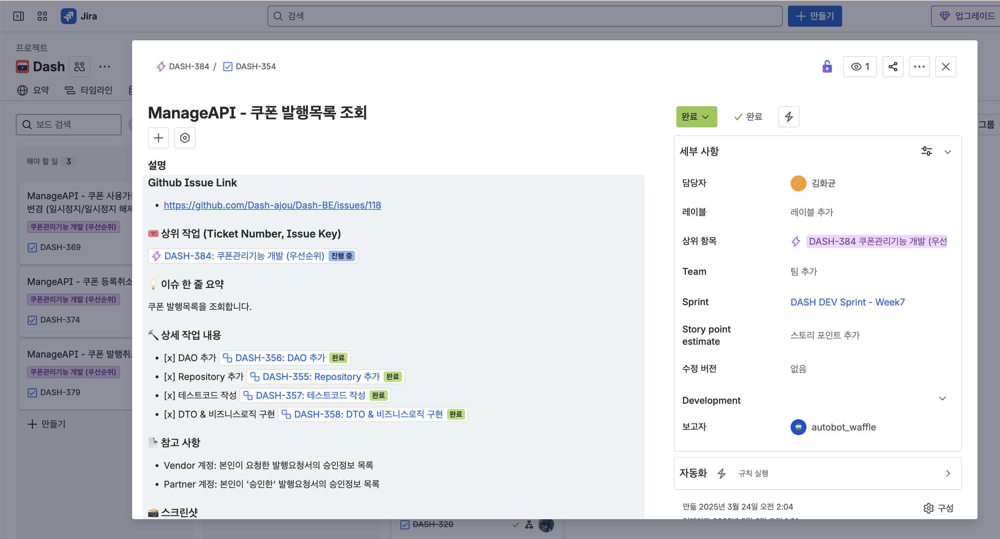

### #Pre.
> 개발자들에게 있어 티켓생성과 관리는 매번 번거로운 부차업무들 중 하나입니다.
> 업계표준으로 불리는 Jira를 개발한 Atlassian에서도 이를 알았는지, 과거 개발자들의 업무를 자동화해줄 묘안을 만들었던 적이 있습니다.
> 
> 오늘 다룰 `gajira-create`는 개발업무 간 적용할 수 있었던 Github Action용 ITSM 모듈입니다.

### #A_`gajira-create`가_뭐죠?

`gajira-create`는 GitHub Actions 워크플로우에서 Jira 이슈를 자동으로 생성해주는 도구였습니다. 
예를 들어, GitHub 리포지토리에 새로운 이슈가 생성되거나 특정 라벨이 붙은 Pull Request가 올라오면, 미리 지정해 둔 Jira 프로젝트에 해당 내용을 담은 티켓을 생성하는 자동화를 구현할 수 있었습니다.

### #B_왜_필요했죠?

가장 큰 이유는 티켓의 관리편의를 위함이었습니다. 
Jira는 Git에서의 활동을 연계하여 보여주는 강력한 기능을 제공하지만, 이를 위해서는 Jira 중심의 repo구성이 필요합니다. 
(ex: Jira 티켓을 먼저 만들고, 관련 issue 생성, commit, branch 생성 등)

특히, 이런 작업의 경우 사람이 직접 해야하므로 **매우 불편합니다**

---

### #C_어떻게_사용하죠?

1. **Jira API 토큰 발급**: Atlassian 계정 설정에서 API 토큰을 발급받습니다. 
2. **GitHub Secrets 설정**: 발급된 토큰과 Jira URL, 계정 이메일을 Github Action 변수로 저장합니다.
    * `JIRA_BASE_URL`: 사용 중인 Jira 인스턴스의 URL (예: `https://your-domain.atlassian.net`)
    * `JIRA_USER_EMAIL`: Jira 계정 이메일 주소
    * `JIRA_API_TOKEN`: 발급받은 API 토큰
3. **Workflow 작성 - ```gajira-login```**: Jira API를 통해 접근하여 티켓을 자동생성할 수 있도록, 아래와 같이 workflow 파일 내 step으로 추가합니다:

```yaml
    - name: Login
      uses: atlassian/gajira-login@v3
      env:
        JIRA_BASE_URL: ${{ secrets.JIRA_BASE_URL }}
        JIRA_USER_EMAIL: ${{ secrets.JIRA_USER_EMAIL }}
        JIRA_API_TOKEN: ${{ secrets.JIRA_API_TOKEN }}
```
4. **Workflow 작성 - ```gajira-create```**: 작성할 티켓 내용을 적절히 구성합니다:
```yaml
- name: Create
  id: create
  uses: atlassian/gajira-create@v3
  with:
    project: GA
    issuetype: Build
    summary: Build completed for ${{ github.repository }}
    description: Compare branch
    fields: '{"customfield_10171": "test"}'
    assignee: ${{ github.event.issue.user.login }}

```

### #D_저는_어땠냐면요

지난학기 학교 캡스톤디자인 프로젝트를 진행하며 본 모듈을 사용해봤었습니다. 
당시에 설정했던 파일은 [링크](https://github.com/Dash-ajou/Dash-FE/blob/publish/.github/workflows/issue_create.jira.yaml)에서 확인하실 수 있어요!


(연동에 성공한 사진도 함께 첨부합니다 😉)

이런 점에서는 매우 편리했습니다:
- 자동으로 생성되는 티켓
- 중앙에서 빠르게 확인가능한 프로젝트 진행현황
- 선행/후속업무의 트래킹 및 업무소요일정 추적 가능

하지만, 이와 함께 몇가지 아쉬움이 있었습니다.
- 이슈가 한번 생성되면 이후 수정사항에 대한 연동이 상호플랫폼 간 이루어지지 않음
- 세부 업무내용에 대한 추적이 Jira 내에서는 불가함
- 연결해야 할 상위 티켓들을 수기로 직접 모두 입력해줘야 함

이런 아쉬움들을 해결하기 위해, 저는 모듈 내부를 분석 후 직접 만들어 팀에 적용하여 문제를 해결했습니다.

~~fork를 떠서 했어야 했는데, 당시 지금만큼 git을 잘 쓸줄 몰라서 그냥 git clone 후 수정해서 저희 repo에 올려 사용했습니다~~

자세한 이야기는 발표에서 정리하여 이야기해보겠습니다..! ☺️