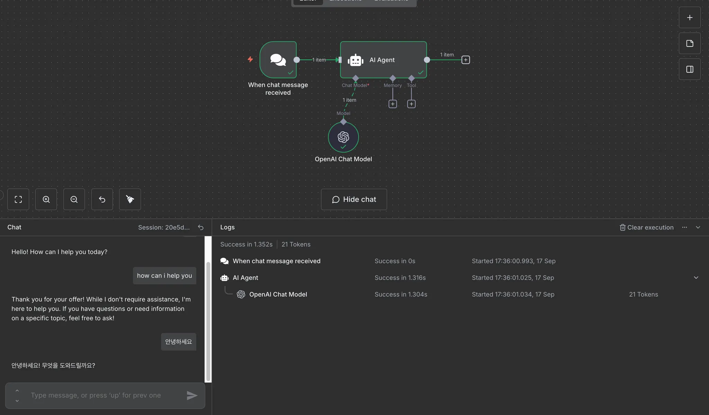

# n8n 자동화 유틸 소개

## n8n이란?

n8n은 **오픈소스 기반의 워크플로우 자동화 플랫폼**으로, 복잡한 비즈니스 프로세스를 시각적인 노드 기반 인터페이스를 통해 자동화할 수 있는 도구입니다. 'nodemation'의 줄임말로, 개발자와 비개발자 모두가 사용할 수 있는 유연하고 강력한 자동화 솔루션을 제공합니다.

### 핵심 특징
- **오픈소스**: 완전히 무료이며 소스코드가 공개되어 있음
- **셀프호스팅 가능**: 자체 서버에 설치하여 데이터 완전 제어 가능
- **노드 기반 UI**: 직관적인 드래그 앤 드롭 방식의 워크플로우 구성
- **광범위한 통합**: 400개 이상의 서비스와 API 연동 지원

## 다른 자동화 툴과의 차이점

### n8n vs Zapier
| 구분 | n8n | Zapier |
|------|-----|--------|
| **가격 모델** | 오픈소스 무료 (클라우드는 유료) | 구독 기반 유료 |
| **데이터 제어** | 완전한 데이터 소유권 | 클라우드 종속 |
| **복잡성** | 고급 워크플로우에 최적화 | 단순한 자동화에 특화 |
| **기술적 유연성** | 높음 (코딩 가능) | 낮음 (GUI 중심) |
| **학습 곡선** | 중간~높음 | 낮음 |

### n8n vs Make (구 Integromat)
- **인터페이스**: n8n은 노드 기반, Make는 시나리오 기반
- **에러 핸들링**: n8n이 더 세밀한 오류 처리 제공
- **비용**: n8n은 셀프호스팅 시 무료, Make는 사용량 기반 과금

## 활용 방법 및 사용 사례

### 1. 마케팅 자동화
- 이메일 캠페인 자동화
- 소셜미디어 포스팅 스케줄링
- 리드 스코어링 및 분류
- 고객 행동 추적 및 분석

### 2. 데이터 관리
- API 간 데이터 동기화
- 데이터베이스 백업 자동화
- 실시간 데이터 모니터링
- 보고서 자동 생성

### 3. IT 운영
- 시스템 상태 모니터링
- 로그 분석 및 알림
- 배포 파이프라인 구축
- 인시던트 대응 자동화

### 4. AI 워크플로우
- 문서 요약 및 번역
- 이미지 분류 및 처리
- 감정 분석
- 챗봇 백엔드 구축

## 개인적인 사용 후기

### 간단한 예시
- n8n에서 AI Agent, OpenAI를 활용하여 채팅기능을 구현해보았습니다. 아직, 메모리 및 부가적인 API를 붙이지 않았지만 굉장히 간단하게 구현이 가능하다는 점을 확인할 수 있었습니다!

- 아래 링크는 워크플로우 생성부터 AI Agent 구현 방법입니다
    ### [링크](https://www.notion.so/N8N-AI-Agent-27114abed5278030ad4cdbde36968578?source=copy_link)

### 장점
1. **높은 자유도**: 복잡한 로직도 구현 가능하며, 커스텀 코드 삽입도 지원
2. **비용 효율성**: 오픈소스로 초기 비용 부담이 적음
3. **데이터 보안**: 셀프호스팅으로 민감한 데이터도 안전하게 처리
4. **활발한 커뮤니티**: 5,000개 이상의 워크플로우 템플릿 제공
5. **확장성**: 필요에 따라 서버 스펙을 조정하여 성능 최적화 가능

### 단점
1. **학습 곡선**: 초기 설정과 개념 이해에 시간 필요
2. **기술적 요구사항**: 셀프호스팅 시 서버 관리 지식 필요
3. **UI 복잡성**: Zapier에 비해 기술적인 인터페이스로 더 깊은 자동화 개념 이해가 필요
4. **한국어 지원**: 인터페이스와 문서가 영어 중심
